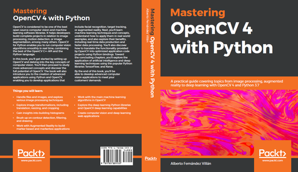

# Mastering-OpenCV-4-with-Python

This is the code repository for [Mastering OpenCV 4 with Python](https://www.packtpub.com/application-development/mastering-opencv-4-python), published by [Packt Publishing](https://www.packtpub.com/). It contains all the supporting project files necessary to work through the book from the first Chapter to the last one.

## Overview
[Mastering OpenCV 4 with Python](https://www.packtpub.com/application-development/mastering-opencv-4-python): A practical guide covering topics from image processing, augmented reality to deep learning with OpenCV 4 and Python 3.7

### Book Details
* ISBN: 139781789344912
* Paperback: 532 pages
* Author: [Alberto Fernández Villán](https://www.linkedin.com/in/albertofernandezvillan/)
* Date of publication: March 2019



Create advanced applications with Python and OpenCV, exploring the potential of facial recognition, machine learning, deep learning, web computing and augmented reality.

### What You Will Learn
* Handle files and images, and explore various image processing techniques
* Explore image transformations, including translation, resizing, and cropping
* Gain insights into building histograms
* Brush up on contour detection, filtering, and drawing
* Work with Augmented Reality to build marker-based and markerless applications
* Work with the main machine learning algorithms in OpenCV
* Explore the deep learning Python libraries and OpenCV deep learning capabilities
* Create computer vision and deep learning web applications

## Code Testing Specifications
*Mastering OpenCV 4 with Python* requires some installed packages, which you can see next.

* Chapter01 (*Setting Up OpenCV*): ``opencv-contrib-python``
* Chapter02 (*Image Basics in OpenCV*): ``opencv-contrib-python matplotlib``
* Chapter03 (*Handling Files and Images*): ``opencv-contrib-python matplotlib``
* Chapter04 (*Constructing Basic Shapes in OpenCV*): ``opencv-contrib-python matplotlib``
* Chapter05 (*Image Processing Techniques*): ``opencv-contrib-python matplotlib``
* Chapter06 (*Constructing and Building Histograms*): ``opencv-contrib-python matplotlib``
* Chapter07 (*Thresholding Techniques*): ``opencv-contrib-python matplotlib scikit-image, scipy``
* Chapter08 (*Contours Detection, Filtering, and Drawing*): ``opencv-contrib-python matplotlib``
* Chapter09 (*Augmented Reality*): ``opencv-contrib-python matplotlib``
* Chapter10 (*Machine Learning with OpenCV*): ``opencv-contrib-python matplotlib``
* Chapter11 (*Face Detection, Tracking, and Recognition*): ``opencv-contrib-python matplotlib dlib face-recognition cvlib requests progressbar keras tensorflow``
* Chapter12 (*Introduction to Deep Learning*): ``opencv-contrib-python matplotlib tensorflow keras``
* Chapter13 (*Mobile and Web Computer Vision with Python and OpenCV*): ``opencv-contrib-python matplotlib flask tensorflow keras requests pillow``

Make sure that the version numbers of your installed packages are equal to, or greater than, versions specified below to ensure the code examples run correctly. If you want to install the exact versions this book was tested on, include the version when installing from pip.

* Install opencv-contrib-python:

```
pip install opencv-contrib-python==4.0.0.21
```
It should be noted that OpenCV requires: ``numpy`` 

``numpy-1.16.1`` has been installed when installing ``opencv-contrib-python==4.0.0.21`` 

 * Install matplotlib:
 
```
pip install matplotlib==3.0.2
```
It should be noted that matplotlib requires: ``kiwisolver pyparsing six cycler python-dateutil``

``cycler-0.10.0 kiwisolver-1.0.1  pyparsing-2.3.1 python-dateutil-2.8.0 six-1.12.0`` have been installed when installing ``matplotlib==3.0.2``

 * Install scikit-image:
```
pip install scikit-image==0.14.2
```
It should be noted that scikit-image requires: ``cloudpickle decorator networkx numpy toolz dask pillow PyWavelets six``

``PyWavelets-1.0.1 cloudpickle-0.8.0 dask-1.1.1 decorator-4.3.2 networkx-2.2 numpy-1.16.1 pillow-5.4.1 six-1.12.0 toolz-0.9.0`` have been installed when installing ``scikit-image==0.14.2``

 * Install scipy:
```
pip install scipy==1.2.1 
```
It should be noted that scipy requires: ``numpy``

``numpy-1.16.1`` has been installed when installing ``scipy==1.2.1``

 * Install dlib:
```
pip install dlib==19.8.1 
```

 * Install face-recognition:
```
pip install face-recognition==1.2.3
```
It should be noted that face-recognition requires: ``dlib Click numpy face-recognition-models pillow``

``dlib-19.8.1 Click-7.0 face-recognition-models-0.3.0 pillow-5.4.1`` have been installed when installing ``face-recognition==1.2.3``

 * Install cvlib:
```
pip install cvlib==0.1.8
```

 * Install requests:
```
pip install requests==2.21.0
```

It should be noted that requests requires: ``urllib3 chardet certifi idna``

``urllib3-1.24.1 chardet-3.0.4 certifi-2018.11.29 idna-2.8`` have been installed when installing ``requests==2.21.0``

 * Install progressbar:
```
pip install progressbar==2.5 
```

 * Install keras:
 
```
pip install keras==2.2.4
``` 
It should be noted that keras requires: ``numpy six h5py keras-applications scipy keras-preprocessing pyyaml``

``h5py-2.9.0 keras-applications-1.0.7 keras-preprocessing-1.0.9 numpy-1.16.1 pyyaml-3.13 scipy-1.2.1 six-1.12.0`` have been installed when installing ``keras==2.2.4``

 * Install tensorflow:
 
```
pip install tensorflow==1.12.0 
```
It should be noted that tensorflow requires: ``termcolor numpy wheel gast six setuptools protobuf markdown grpcio werkzeug tensorboard absl-py h5py keras-applications keras-preprocessing, astor``

``termcolor-1.1.0 numpy-1.16.1 wheel-0.33.1 gast-0.2.2 six-1.12.0 setuptools-40.8.0 protobuf-3.6.1 markdown-3.0.1 grpcio-1.18.0 werkzeug-0.14.1 tensorboard-1.12.2 absl-py-0.7.0 h5py-2.9.0 keras-applications-1.0.7 keras-preprocessing-1.0.9 astor-0.7.1`` have been installed when installing ``tensorflow==1.12.0``

 * Install flask:
```
pip install flask==1.0.2
```

It should be noted that flask requires: ``Werkzeug click itsdangerous MarkupSafe Jinja2``

``Jinja2-2.10 MarkupSafe-1.1.1 Werkzeug-0.14.1 click-7.0 itsdangerous-1.1.0`` have been installed when installing ``flask==1.0.2``

## Hardware Specifications
The hardware specifications are as follows:

* Either 32-bit or 64-bit architecture
* 2+ GHz CPU
* 4 GB RAM
* At least 10 GB of hard disk space available

## Related books & products
* [OpenCV Computer Vision with Python](https://www.packtpub.com/application-development/opencv-computer-vision-python)
* [OpenCV: Computer Vision Projects with Python](https://www.packtpub.com/application-development/opencv-computer-vision-projects-python)
* [Augmented Reality for Developers](https://www.packtpub.com/web-development/augmented-reality-developers)
* [Deep Learning with Python and OpenCV](https://www.packtpub.com/big-data-and-business-intelligence/deep-learning-python-and-opencv)
* [Deep Learning with Keras](https://www.packtpub.com/big-data-and-business-intelligence/deep-learning-keras)
* [Getting Started with TensorFlow](https://www.packtpub.com/big-data-and-business-intelligence/getting-started-tensorflow)
* [Mastering Flask Web Development - Second Edition](https://www.packtpub.com/web-development/mastering-flask-web-development-second-edition)
